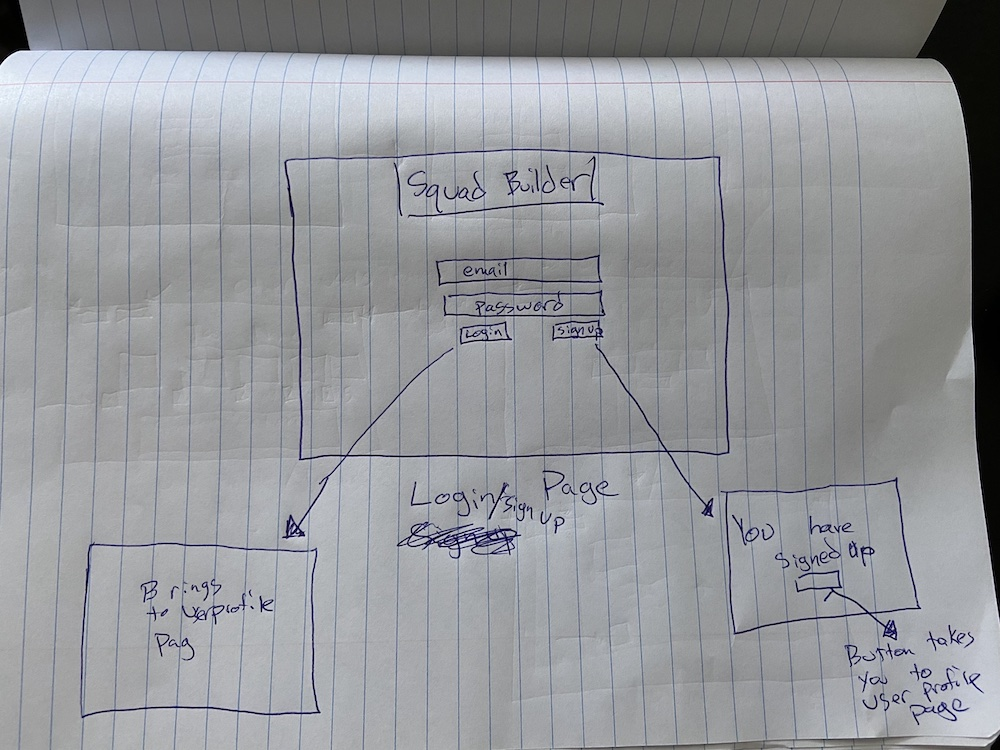
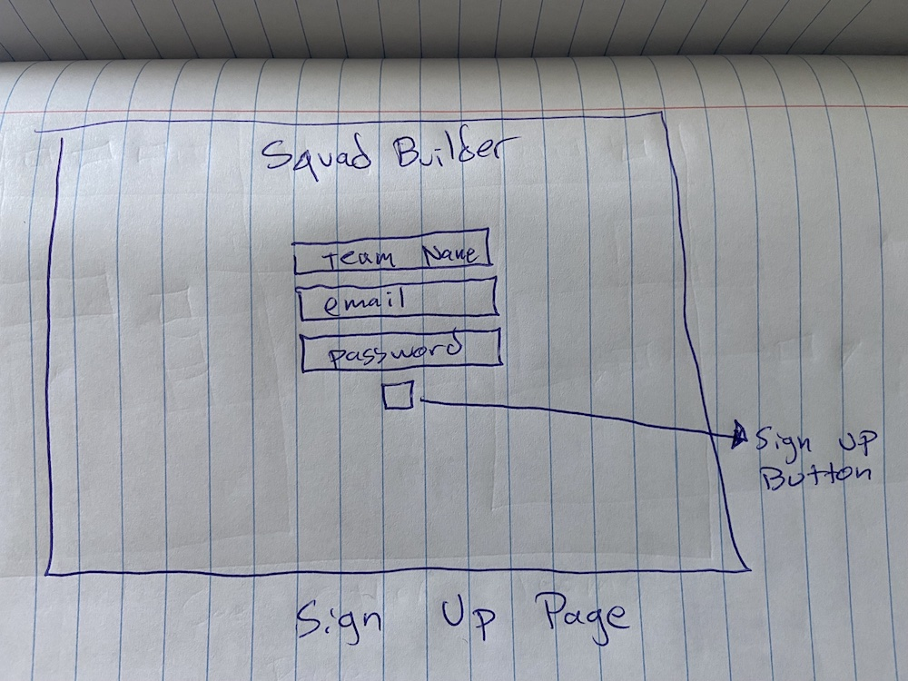
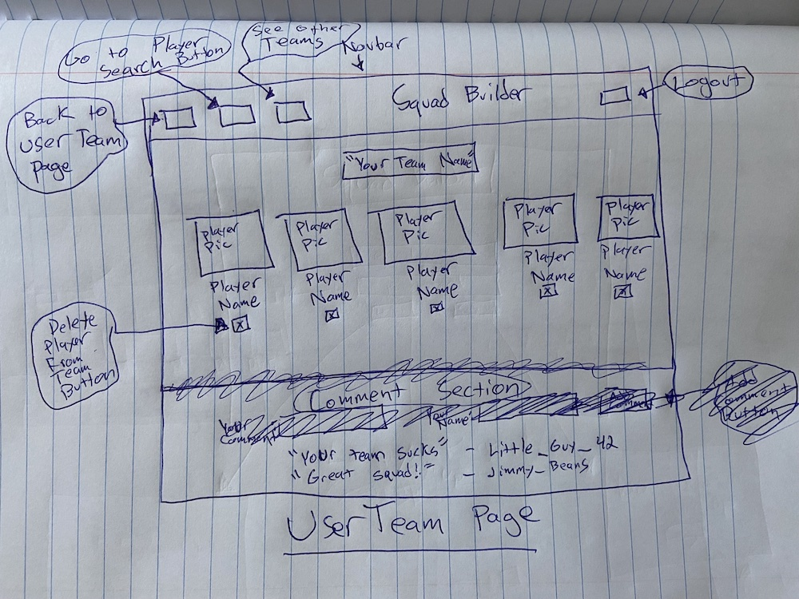
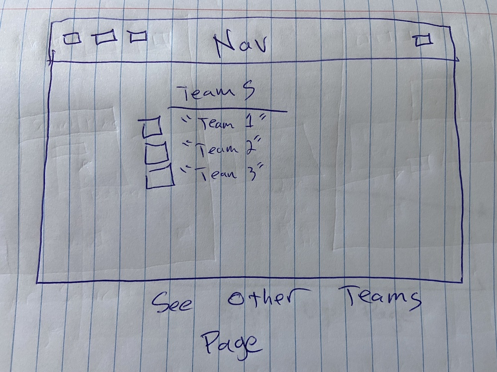
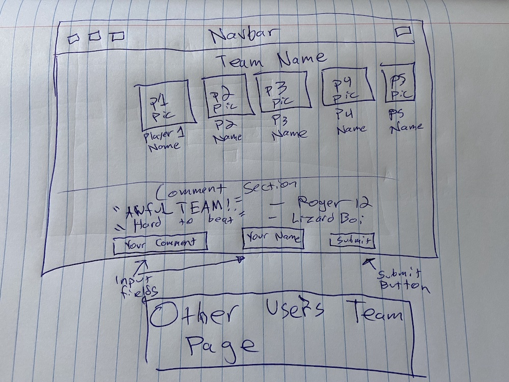
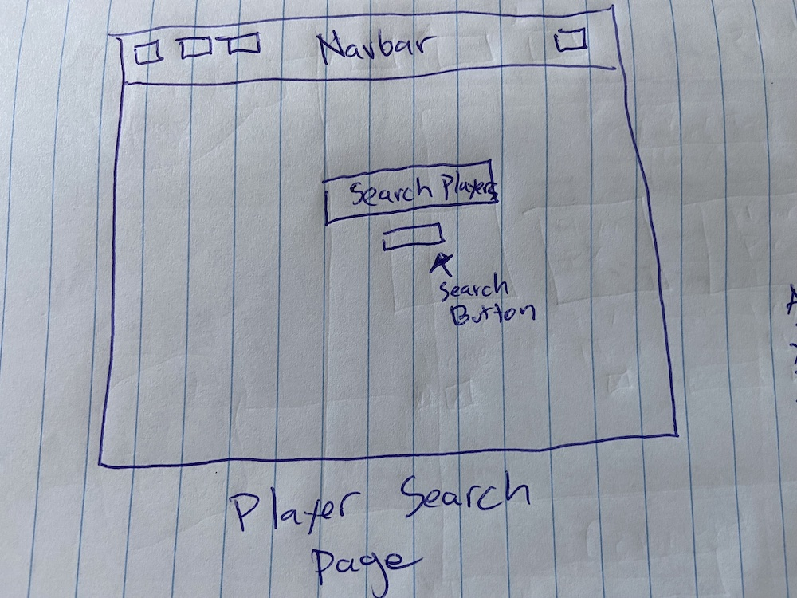
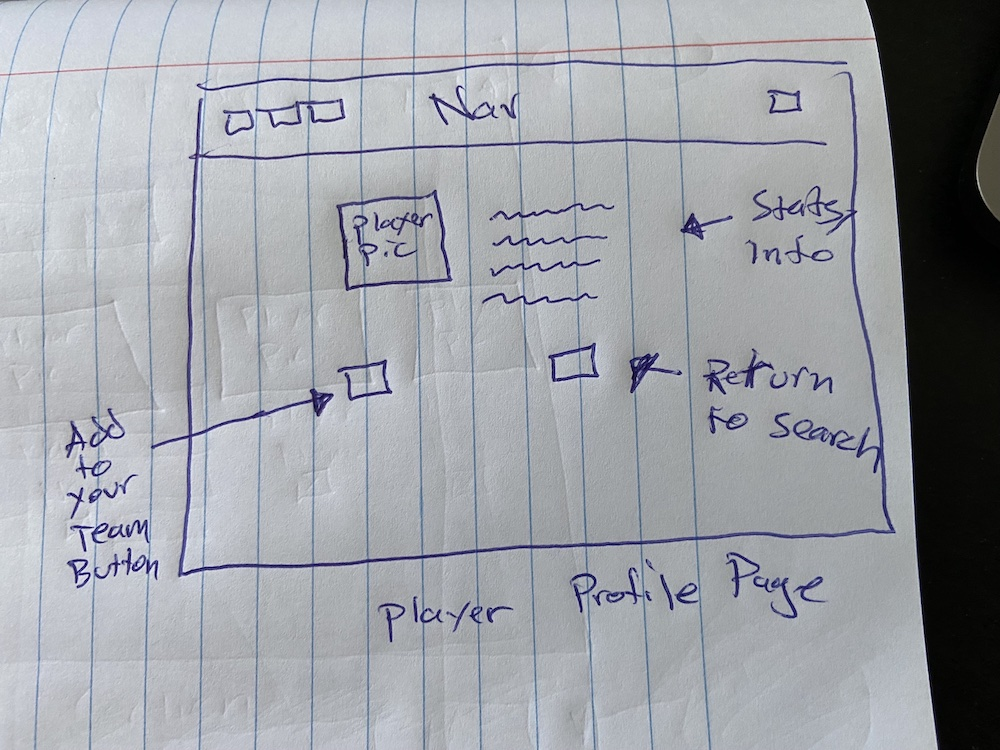
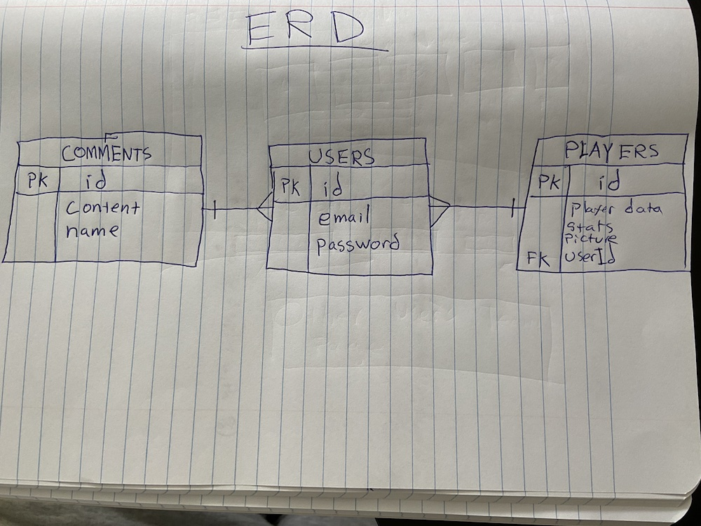

# __Squad Builder__
 
 ### Installation Instructions:
  N/A
 ---
 
 ### What's happenin
 ---
 This app will use the ballislife API (https://www.balldontlie.io/#introduction) to give user the ability to search through all current NBA players in order to find season stats, height, weight, position and a few other stats, in addition to a picture of the player. On the player profile page, user will have the ability to add player to their team, depending on what positions they have already drafted for, pretty much in the format of an NBA fantasy league. Once user teams have been created, there will be a comment section below each team where other users can make comments like in the blog lab that we had. Users will be able to delete players from their teams and add new ones as they please.
 
 ### User Stories
 ---
 * As a user, I want to search NBA players by name and see player profile pages when clicked on
 * As a user, I want to have the ability to add and delete players from my team
 * As a user, I want to be able to view other user's teams and comment on those teams

 ### Approach
 ---
 N/A
 
 ### Tech Used
 ---
 N/A

 ### Reflection
 ---
 N/A

 
 
 
 
 
 
 

 
 
 ### RESTful Routing Chart
 ---
 | **VERB** | **URL Pattern** | **Action (CRUD)** | **Description** |
 | -------- | --------------- | ----------------- | --------------- |
 | GET | */users/login* | Show (Read) | renders login page |
 | POST | */users/login* | Create (Create) | authenticates user credentials against database |
 | GET | */users/new* | Show (Read) | renders sign up page |
 | POST | */users/* | Create (Create) | creates new user and redirects to yourSquad page |
 | GET | */users/logout* | Show (Read) | clears the cookie to log user out |
 | GET | */users/yourSquad* | Show (Read) | renders yourSquad page |
 | POST | */players* | Create(Create) | creates new player on your team (like favorite) |
 | DELETE | */players/:id* | Destroy (Delete) | deletes the player with the specified id from your team (i.e. /players/1) | 
 | GET | */players/details* | Show (Read) | shows a specific player profile page (has a form that POSTS to /players, creates new player in db) |
 | GET | */users/:id* | Show (Read) | renders otherTeam page |
 | GET | */users/:id/comment/new* | New (Read) | shows a form to make a new comment |
 | POST | */users/:id/comment* | Create (Create) | creates a comment with the POST payload(form) data |
 | PUT | */users/yourSquad* | Update (Update) | update your squad name | 

 ### MVP
 ---
 1. Create sign up, login and logout pages
 2. Create form to search for NBA players
 3. Render individual player profiles with stats and picture, in addition to 'Add to Team' (favorite) button
 4. Render user's team page (user profile page) with:
    * delete button for players
    * comment section

 ### Stretch Goals
 ---
 1. Ability to search by team
 2. Add more than five starting players to team (bench players)
 3. Add player career stats to player profile pages
 4. Some real nice CSS
 5. Usernames? (gonna just start with email's and then individual users can just name their teams)
 6. Select option drop down on Player Search bar
 
 ### Sources
 ---
 * N/A
